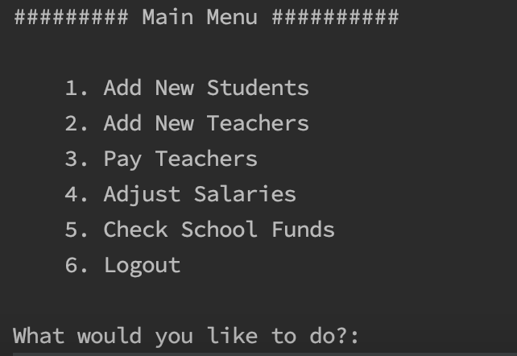
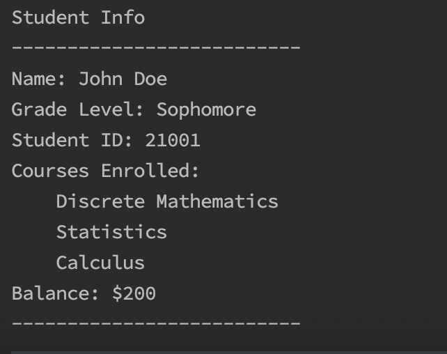
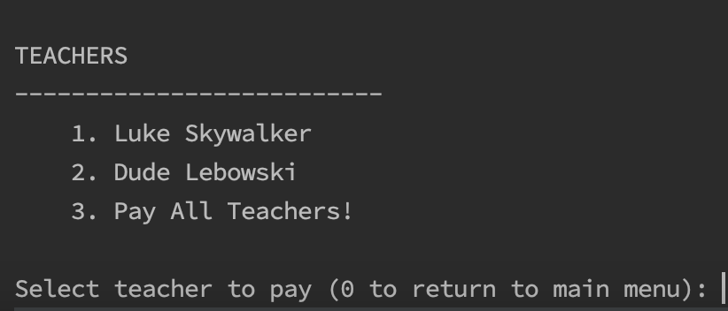
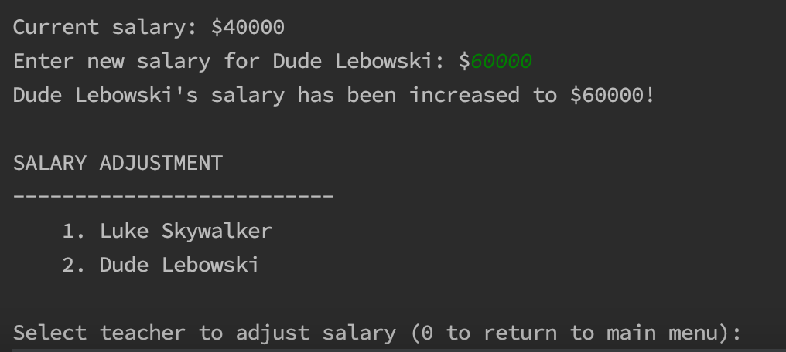
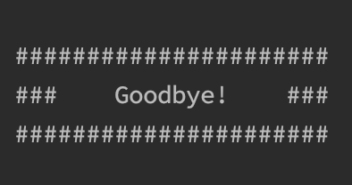

# Welcome to EduAssist!
EduAssist is a simple console-based school management system demonstrating some object-oriented programming concepts
## What It Does
Login to EduAssist to do the following:
- Add New Students
	- Enter the number of students you would like to add
		- A unique student ID number is automatically generated for each student
	- Enter student(s) name
	- Select their grade year
	- Enroll them in classes from the list of available options
	- Enter the amount of tuition that the student has paid (each class costs $700)
- Add New Teachers
	- Enter the number of teachers you would like to add
		- A unique teacher ID number is automatically generated for each teacher
	- Enter teacher(s) name
	- Select the subject that they will teach
	- Enter their starting salary
- Pay Teachers
	- Select which teachers to give biweekly paycheck. There is an option to pay all
- Adjust Salaries
	- Select a teacher to give a salary increase or decrease
- Check School Funds
	- Print out school funds based on tuition received from students and salary paid to teachers

## Login Information
Login information is stored in users.txt file in the root directory. Each line is an acceptable username and password separated by a comma.

More users can be added by simply appending a new user,password line to users.txt.

A user will be prompted to enter username and password on program start. Users have 3 attempts to successfully login.

## How it Works 
Once logged in, a user will be presented with six (6) options from the Main Menu and prompted to select what they would like to do.

A user can operate in EduAssist for as long as they like before logging out. A while(true) loop is utilized to keep the program running until the user opts to logout.

An unknown number of student/teacher objects will need to be created at every program start. If a user chooses to (1) add new students or (2) add new teachers then they will be prompted to enter how many. The program will loop the object creation process for as many times as the user has entered.

A user can choose to (3) pay or (4) adjust salaries of teachers. Selecting either of these options will generate a list of all teachers that were entered previously. The user can then select a teacher and update appropriate info.

Only one school object will be created each time the program is run. School fund information is stored in the School class and can be viewed by selecting option (5) from Main Menu.

A Util class is used for error catching methods. These Util class methods are for when a user is prompted for input and an integer is expected. Method overloading is used to alter the method depending on the need. For example, sometimes any integer entered is valid ("Please enter number of new students to enroll") whereas other times only an integer within a range is valid (only integers 1-6 valid on Main Menu).

## How to Use
Make a clone of repo and run Main in your preferred IDE. Java needs to be installed on your local system.

## Future Updates
My future goal for this project is to connect it to a database where student, teacher, and school info from each session can be stored.  This project was for educational purposes only but adding database connectivity would get it closer to a real-world application.

## Credits
Credit where credit is due! I used the below youtube tutorials to help get started. Would highly recommend if you are looking to build something similar.

https://www.youtube.com/watch?v=GOGt7PACl10

https://www.youtube.com/watch?v=e0X00EoFQbE

https://www.youtube.com/watch?v=XrktMbcoeis

 

